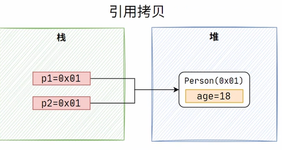
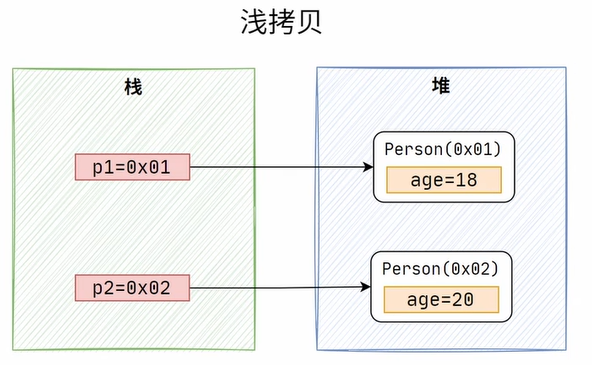
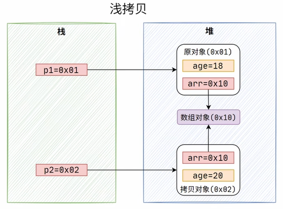
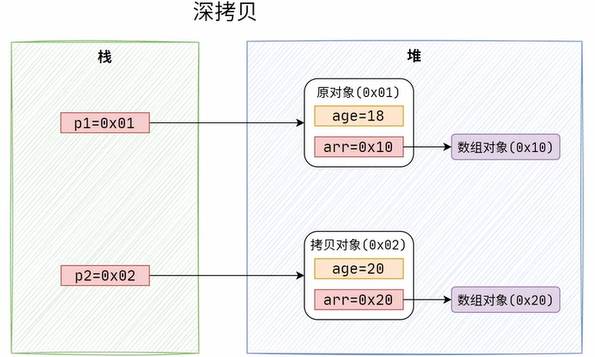
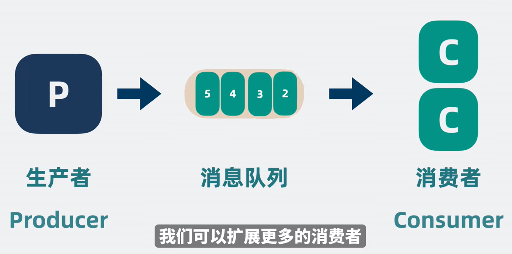
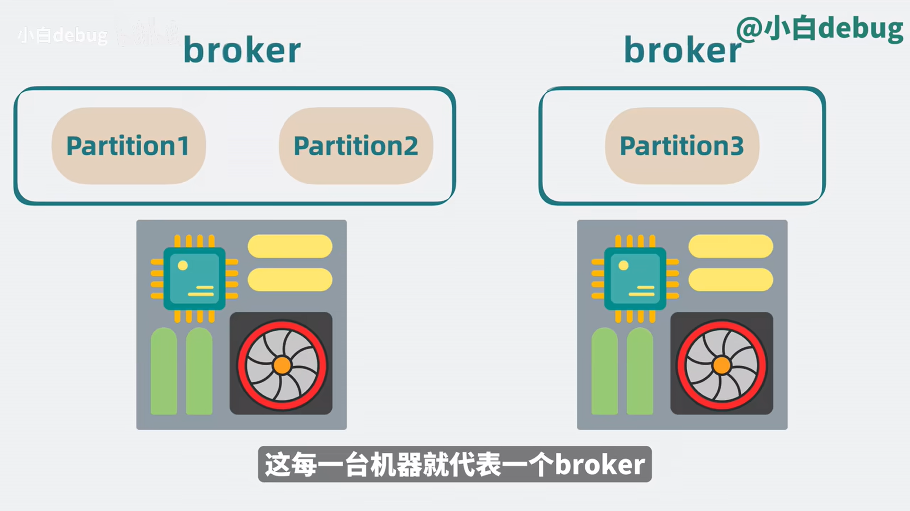
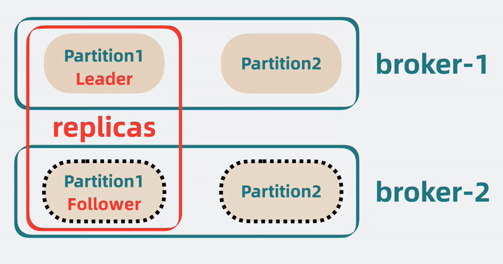
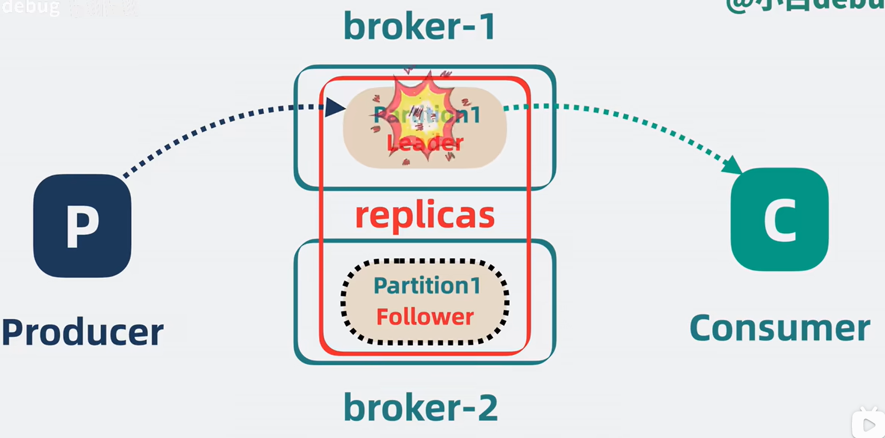
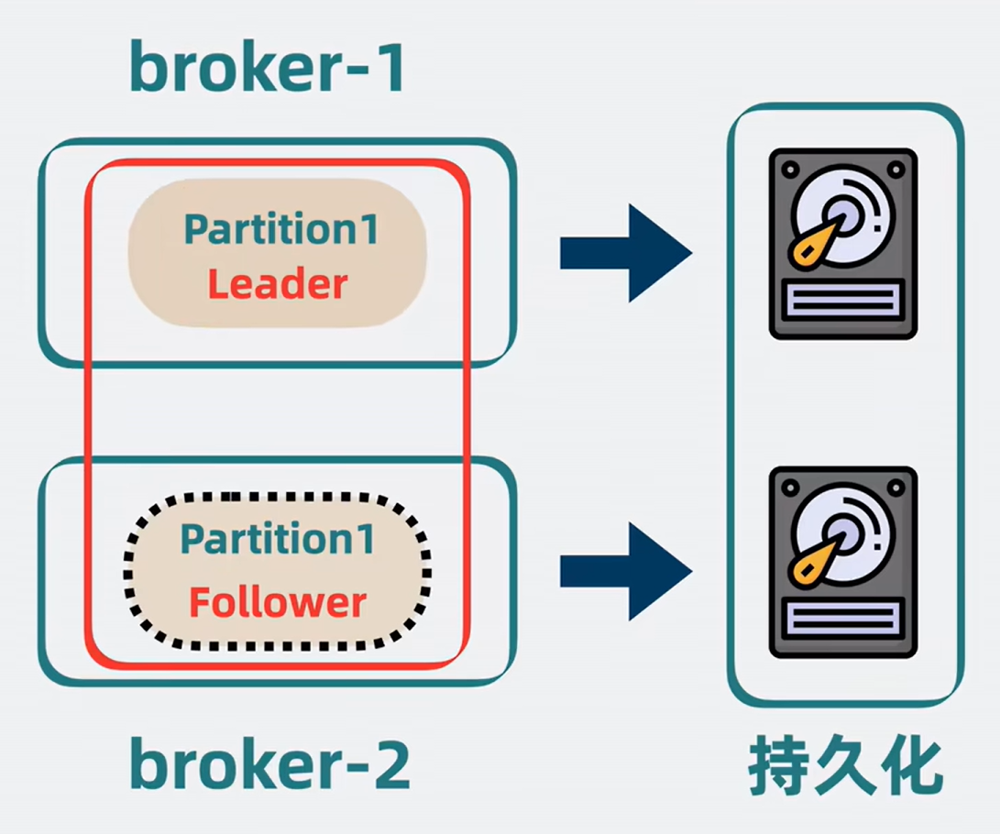
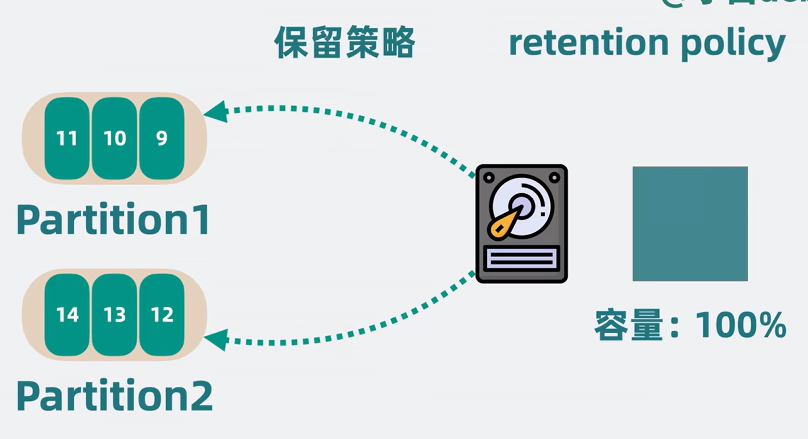

### 如何理解泛型（本质：语法糖+类型擦除）
1、保证了类型的安全性.没有之前是Object 需要存放的类型多样，取出需要显式转换

2、进行类型检查，提高代码编写量
  
3、避免装箱拆箱，提高性能

类型擦擦-〉兼容之前版本的java代码

一段泛型代码的编译运行过程如下：

1.编译期间编译器检查传入的泛型类型与声明的泛型类型是否匹配，不匹配则报出编译器错误；

2.编译器执行类型擦除，字节码内只保留其原始类型；

3.运行期间，再将 Object 转换为所需要的泛型类型。

也就是说：Java 的泛型实际上是由编译器实现的，将泛型类型转换为 Object 类型，在运行期间再进行状态转换。

### JAVA特性：封装 继承 多态
多态 类的多重实现形式
向上转型和向下转型

### String为什么是不可变的，有什么好处？
String底层是由一个char数组实现 被private修饰，且没有提供修改的方法， 且被final关键字修饰 表示该类无法被继承 方法也无法被重写

### 对象拷贝相关
- 引用拷贝：直接进行了赋值的操作



- 浅拷贝

  

字段相关：基本类型 -> 复制值 引用类型 -> 指向相同的对象（如下图）


12 
- 深拷贝 （若字段存在引用类型，不指向相同的对象）

如何实现？ 在引用类型的拷贝时，调用引用类型的clone()方法



### 接口和抽象类的区别
主要区别：

抽象类可以包含成员变量、普通方法以及构造方法的实现，而接口只能包含常量和抽象方法。

一个类只能继承一个抽象类，但可以实现多个接口。

抽象类用于表示一种"is-a"关系，而接口用于表示一种"has-a"或"can-do"关系，即抽象类表示对一类事物的抽象，而接口表示对行为的抽象。
通常情况下，如果需要表示一种"is-a"的关系并且希望提供一些默认的实现，可以使用抽象类；如果需要表示一种"has-a"或"can-do"的关系，并且希望实现多继承，可以使用接口。在实际应用中，抽象类和接口经常结合使用，以达到更好的代码组织和设计。

### JVM
新生代收集器（全部的都是复制算法）：Serial、ParNew、Parallel Scavenge
老年代收集器：CMS（标记-清理）、Serial Old（标记-整理）、Parallel Old（标记整理）
整堆收集器： G1（一个Region中是标记-清除算法，2个Region之间是复制算法） 同时，先解释几个名词：
1，并行（Parallel）：多个垃圾收集线程并行工作，此时用户线程处于等待状态
2，并发（Concurrent）：用户线程和垃圾收集线程同时执行
3，吞吐量：运行用户代码时间／（运行用户代码时间＋垃圾回收时间）

### 为何要使用元空间来替代永久代
与永久代相比，使用元空间使用方法区具有以下优点：

- 突破内存限制，减少OOM。 由于元空间使用的是本地内存，而不是 JVM 内存，因此理论上，其大小只受限于操作系统的实际可用内存。这大大减少了内存溢出的可能性。相较于永久代在 JVM 堆中预分配的有限空间，元空间的引入提供了更大的空间来存储类元数据。

- 提高 Full GC 的效率。 在永久代中，Full GC 的触发比较频繁，而且效率较低。因为永久代中存放了很多 JVM 需要的类信息，这些数据大多数是不会被清理的，所以 Full GC 往往无法回收多少空间。但在元空间模型中，由于字符串常量池已移至堆中，静态变量也移至 Java 堆或者本地内存，因此可以更有效地进行垃圾回收，避免了因频繁的 Full GC 导致的性能影响。

### 为什么hashmap的容量都是2的次幂
高效的取模操作
在HashMap中，当我们插入或查找一个元素时，需要将键的哈希值转换为数组索引位置。这通常通过取模操作实现：
```
index = hash % capacity
```
取模操作通常比较耗时，为了提高性能，HashMap采用了位运算来代替取模操作。当容量是2的次幂时，可以使用位运算进行快速取模：

```
index = hash & (capacity - 1)
```
简化扩容操作
HashMap在装载因子（load factor）超过一定阈值时会进行扩容（resize）操作。扩容时，新的容量通常是旧容量的两倍。由于新旧容量都是2的次幂，键的哈希值在新容量中的位置只需在原位置基础上进行简单的位运算调整即可。

### 如何排查JVM内存泄漏
- 定位问题，是否出现了内存泄漏
  - 老年代逐步增长
  - FullGC卡顿
  - 年轻代内存处于高位无法释放
  - 频繁FullGC
- 确定出现了潜在的内存泄漏的情况，使用相关工具进一步排查类
1. 命令查看
```
jstal   // 查看虚拟机中内存区域的使用情况及GC情况
```
2. 使用dump把内存dump下来
3. 使用mat工具对dump进行分析
4. 根据分析的结果定位到具体的类，进行代码的修改


### 消息队列

解决并发环境下的非阻塞通信，满足以下特征：
- 高性能
- 高扩展性
- 高可用
- 持久化和过期策略
1. 对于效率低的服务，如何提升性能？

提升消费速度和生产速度

如果两者吞吐都变多，可能会出现阻塞的状态，可以分不同的topic队列，消费者根据不同的topic订阅消费

且可以将单个topic分为不同的partition分发给不同的消费者

2. 高扩展性
随着Partition变多，单机的CPU和内存过高，影响整体系统性能，可以将partition部署到不同的机器上

3. 高可用
如果单个broker里的数据挂了，那里面的partition都没了
通过增加副本来解决

leader应付生产者消费者请求,follower负责同步leader里面的数据

即使挂了leader，也可以拷贝follower的数据

但是如果所有的broker都挂了，那不就寄了，数据全丢失了？ 

我们需要将数据持久化到磁盘中，同时通过策略来保证磁盘不超出容量


### 线程池
1. 创建线程池的方式
- 使用ThreadPoolExecutor
-   使用Executor中的静态方法实例化ThreadPoolExecutor对象
-   Executor可创建多种不同类型的线程池对象：
    -   FixedThreadPool         固定线程数量
    -   SingleThreadExecutor    单一线程的线程池        FixedThreadPool 和 SingleThreadExecutor:使用的是无界的 LinkedBlockingQueue，任务队列最大长度为 Integer.MAX_VALUE,可能堆积大量的请求，从而导致 OOM。
    -   CachedThreadPool        根据实际情况动态调整线程的数量     使用的是同步队列 SynchronousQueue, 允许创建的线程数量为 Integer.MAX_VALUE ，如果任务数量过多且执行速度较慢，可能会创建大量的线程，从而导致 OOM。
    -   ScheduledThreadPool     设定周期，定期执行任务
2. 线程池参数
- 核心线程数
- 最大线程数
- 过期时间
- 时间单位
- 线程工厂
- 任务队列
- 拒绝策略
3. 拒绝策略 -> ThreadPoolExecutor内部类
- `AbortPolicy`：抛出异常
- `DiscardPolicy`：直接丢弃
- `DiscardOldestPolicy`：丢弃最早的
- `CallerRunsPolicy`：调用执行`run()`方法，将任务交给主线程执行，优点是不会丢弃任务，缺点是耗时较长，会阻塞主线程。

### Parallel Scavenge 和 CMS 垃圾收集器对比

| 特性            | Parallel Scavenge                | CMS                                    |
|-----------------|----------------------------------|----------------------------------------|
| **目标**        | 最大化应用程序的吞吐量            | 最小化垃圾收集导致的停顿时间            |
| **类型**        | 新生代垃圾收集器                  | 老年代垃圾收集器                        |
| **算法**        | 复制算法（Copying Algorithm）     | 标记-清除（Mark-Sweep）算法             |
| **并发性**      | 垃圾收集期间使用多个线程并行执行   | 大部分垃圾收集工作与应用程序线程并发执行  |
| **优点**        | 高吞吐量，充分利用多核处理器      | 低停顿时间，适用于响应时间要求高的应用  |
| **缺点**        | 停顿时间较长，不适用于响应时间高的应用 | 碎片问题，高 CPU 开销，可能触发 `Full GC` |
| **配置参数**    | `-XX:+UseParallelGC` <br> `-XX:ParallelGCThreads=<N>` <br> `-XX:MaxGCPauseMillis=<N>` <br> `-XX:GCTimeRatio=<N>` | `-XX:+UseConcMarkSweepGC` <br> `-XX:+CMSParallelRemarkEnabled` <br> `-XX:ParallelCMSThreads=<N>` <br> `-XX:+CMSScavengeBeforeRemark` <br> `-XX:CMSInitiatingOccupancyFraction=<N>` |
| **适用场景**    | 需要高吞吐量的应用，如后台批处理、大数据处理、科学计算 | 对响应时间要求高的应用，如 Web 服务、在线游戏、交互式应用、实时交易系统 |

# JVM 内存分配方式

在 JVM 中，内存的分配方式主要包括以下几种区域，每个区域有不同的用途和分配策略：

## 1. 堆（Heap）

堆是 JVM 中最大的一块内存区域，用于存储所有的对象实例和数组。堆分为两部分：

### 新生代（Young Generation）
- **Eden 区**：新对象首先在这里分配内存。
- **Survivor 区**：分为两个区（S0 和 S1），用于在垃圾收集时存放从 Eden 区复制过来的存活对象。

### 老年代（Old Generation）
- 用于存储经过多次垃圾收集仍然存活的对象，通常是生命周期较长的对象。

## 2. 方法区（Method Area）

方法区又称为永久代（Permanent Generation）或元空间（Metaspace），存储类的元数据，如类信息、常量池、静态变量、即时编译器编译后的代码等。元空间在 JDK 8 以后取代了永久代。

## 3. 栈（Stack）

每个线程都有自己的栈，存储局部变量、方法参数和方法调用的上下文。栈中的变量具有线程私有性，不会在线程之间共享。

## 4. 本地方法栈（Native Method Stack）

用于执行本地（Native）方法的栈。与 Java 栈类似，每个线程都有自己的本地方法栈，存储本地方法调用的信息。

## 5. 程序计数器（Program Counter Register）

每个线程都有自己的程序计数器，用于记录当前线程执行的字节码的行号指示器。在多线程的情况下，程序计数器帮助线程恢复正确的执行位置。

## 6. 堆外内存（Off-Heap Memory）

由 Java 的 `DirectByteBuffer` 类使用，用于在堆之外分配内存。堆外内存的分配和释放由 JVM 直接管理，适用于需要频繁分配和释放内存的场景。

## 内存分配策略

1. **TLAB（Thread Local Allocation Buffer）：**
   每个线程在新生代的 Eden 区预留一块内存，用于快速分配对象，减少线程竞争。

2. **大对象直接进入老年代：**
   大对象（如大数组）直接在老年代分配，避免新生代频繁 GC。

3. **长期存活的对象进入老年代：**
   对象在新生代经过多次 GC 仍然存活时，晋升到老年代。

4. **逃逸分析（Escape Analysis）：**
   通过逃逸分析确定对象是否可以在栈上分配，从而减少堆内存分配的压力。

### 指针碰撞和空闲链表对比

| 特性              | 指针碰撞（Pointer Bumping）                    | 空闲链表（Free List）                         |
|-------------------|------------------------------------------------|-----------------------------------------------|
| **工作原理**      | 移动指针到下一个可用内存位置                    | 维护一个链表，记录所有空闲内存块               |
| **使用场景**      | 适用于连续内存分配，常用于复制算法              | 适用于非连续内存分配，常用于标记-清除算法       |
| **优点**          | - 效率高：分配速度快<br>- 内存连续：提高缓存命中率 | - 灵活性高：有效利用内存碎片<br>- 适用于分散内存 |
| **缺点**          | - 需要定期整理内存<br>- 内存需要连续             | - 效率较低：维护链表开销大<br>- 容易产生碎片    |
| **适用算法**      | 复制算法                                       | 标记-清除算法                                 |
| **内存管理**      | 需要垃圾收集器定期整理内存                      | 不要求内存整理，适用于碎片化的内存环境         |


### 线程模型
- 一对一 1:1
- 多对一 N:1
- 多对多 N:M