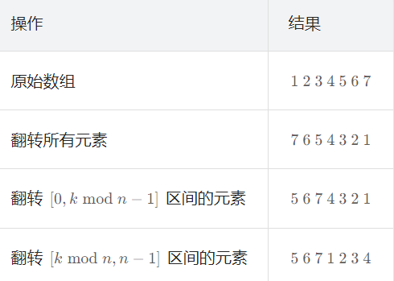

# 轮转数组
### 题目描述
给定一个整数数组 nums，将数组中的元素向右轮转 k 个位置，其中 k 是非负数。


示例 1:

输入: nums = [1,2,3,4,5,6,7], k = 3
输出: [5,6,7,1,2,3,4]
解释:
向右轮转 1 步: [7,1,2,3,4,5,6]
向右轮转 2 步: [6,7,1,2,3,4,5]
向右轮转 3 步: [5,6,7,1,2,3,4]
示例 2:

输入：nums = [-1,-100,3,99], k = 2
输出：[3,99,-1,-100]
解释:
向右轮转 1 步: [99,-1,-100,3]
向右轮转 2 步: [3,99,-1,-100]
### 思路
- 数组填充

对当前k值取模，防止k值大于数组长度 k %= nums.length

对数组进行填充，前k个数是原数组后k位

剩余位数为前n - k个数

```java
public void rotate(int[] nums, int k) {
        // 特殊情况处理
        if(nums.length == 1){
            return;
        }else if(nums.length < k){
            k %= nums.length;
        }
        int[] temp = new int[nums.length];

        for(int i = 0;i < nums.length; i++){
            temp[i] = nums[i];
        }
        // 填充前两位
        for(int i = 0; i < k; i++){
            int tempIndex = nums.length - k;
            nums[i] = temp[tempIndex + i];
        }

        // 填充剩余数字
        for(int i = k; i < nums.length; i++){
            nums[i] = temp[i - k];
        }
    }
```

- 反转数组

观察可知



```java
public void rotate(int[] nums, int k) {
        k %= nums.length;
        reverse(nums,0,nums.length - 1);
        reverse(nums,0,k - 1);
        reverse(nums,k,nums.length - 1);
    }

    // 反转数组
    public void reverse(int[] nums, int left,int right){
        while(left < right){
            int temp = nums[left];
            nums[left] = nums[right];
            nums[right] = temp;

            // 更新指针
            left++;
            right--;
        }
    }
```