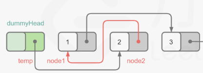

# 两两交换链表节点
### 题目描述
给你一个链表，两两交换其中相邻的节点，并返回交换后链表的头节点。你必须在不修改节点内部的值的情况下完成本题（即，只能进行节点交换）。


示例 1：


输入：head = [1,2,3,4]
输出：[2,1,4,3]
示例 2：

输入：head = []
输出：[]
示例 3：

输入：head = [1]
输出：[1]

### 思路
类似于“反转链表”三指针的思路，这里需要引入一个哑节点用以标识结果的位置
- 声明preNode curNode nextNode
- 以preNode的位置来维护curNode和nextNode的位置
- 终止的条件是curNode和nextNode的位置不为空
- 关键点是如何进行反转
  - preNode先指向nextNode
  - curNode指向nextNode下一个节点(先进行，不然会丢失这个节点)
  - curNode指向preNode 实现前两个节点翻转
  - 
  - 
- 更新preNode的值
  - 
```java
/**
 * Definition for singly-linked list.
 * public class ListNode {
 *     int val;
 *     ListNode next;
 *     ListNode() {}
 *     ListNode(int val) { this.val = val; }
 *     ListNode(int val, ListNode next) { this.val = val; this.next = next; }
 * }
 */
class Solution {
    public ListNode swapPairs(ListNode head) {
        // 哑结点用以标识结果
        ListNode dummyHead = new ListNode(0);
        dummyHead.next = head;

        // 三指针 pre cur next
        ListNode preNode = dummyHead;
        while (preNode.next != null && preNode.next.next != null) {
            // 初始化/维护curNode nextNode新位置
            ListNode curNode = preNode.next;
            ListNode nextNode = preNode.next.next;

            // 更新规则：preNode先指向2 1再指向3 2再指向1 实现位置调转
            // 下面的顺序不能调换 否则失去3的位置 也就是nextNode.next
            preNode.next = nextNode;
            curNode.next = nextNode.next;
            nextNode.next = curNode;

            // 维护preNode新位置 跳转了两个位置
            preNode = curNode;
        }
        return dummyHead.next;
    }
}
```