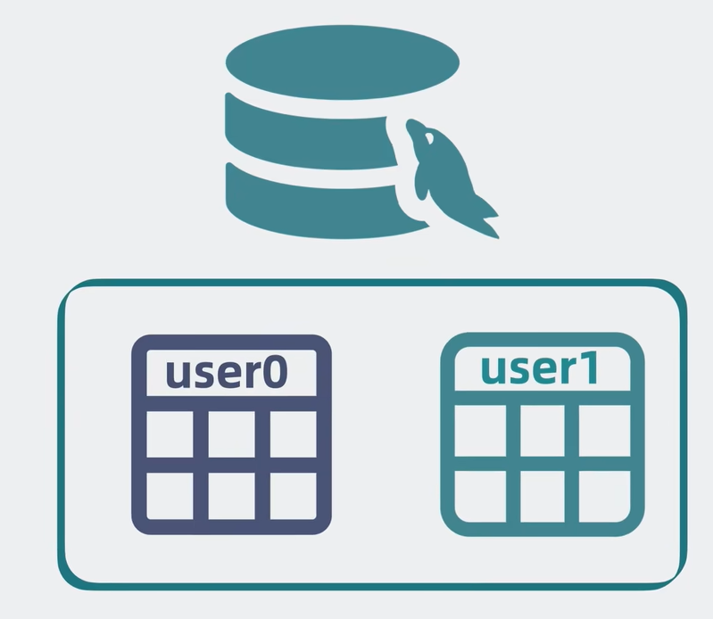
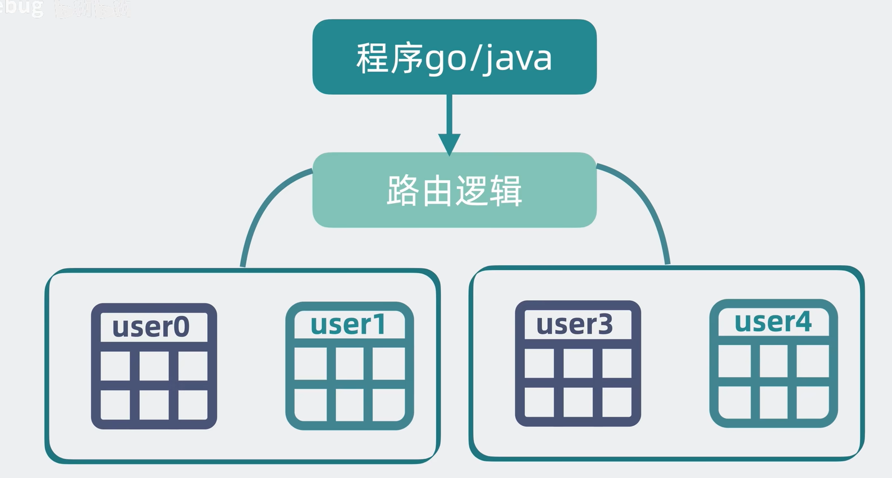
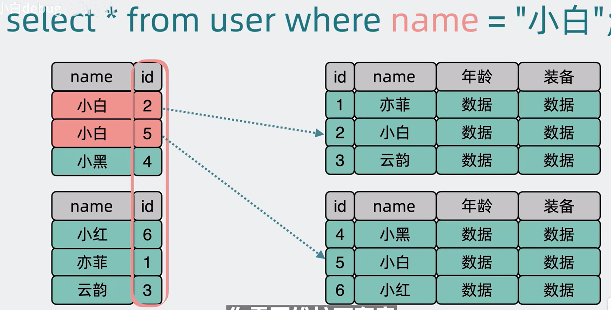
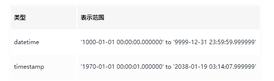
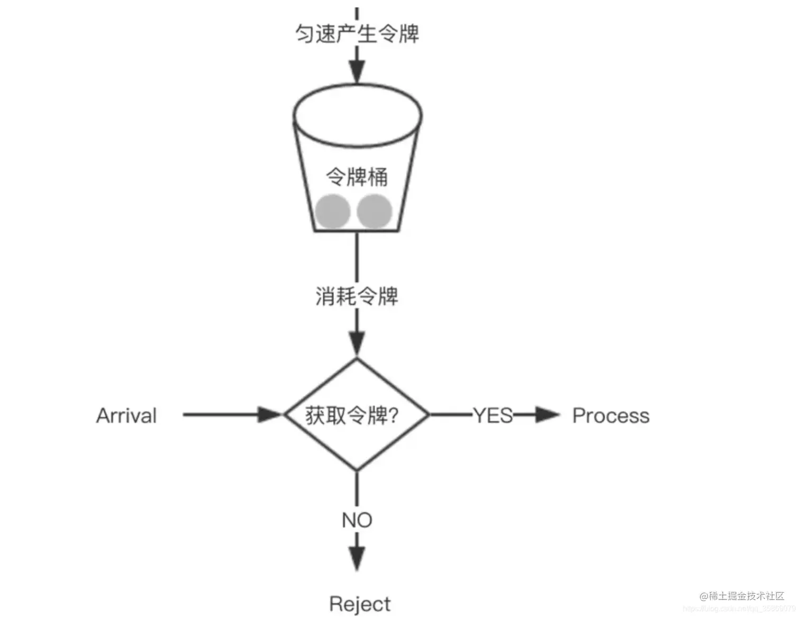

### 优化的思路（运维相关）
优化mysql索引(优化慢查询) -> 中间件加缓存 -> 分库分表

问题：什么是慢查询呢？

慢查询是指数据库中查询时间超过指定阈值（美团设置为100ms）的SQL，它是数据库的性能杀手，也是业务优化数据库访问的重要抓手。随着美团业务的高速增长，日均慢查询量已经过亿条，此前因慢查询导致的故障约占数据库故障总数的10%以上，而且高级别的故障呈日益增长趋势。因此，对慢查询的优化已经变得刻不容缓。

**索引优化思路：**
- 1、确定慢查询（即有没有这个东西先，且在哪里）
首先，需要找出哪些查询运行缓慢。可以通过启用和查看慢查询日志来实现这一点。在MySQL中，可以设置慢查询日志来记录执行时间超过设定阈值的查询。
- 2、分析查询和表结构
  使用 explain 命令来分析慢查询。这个命令会显示MySQL如何执行查询，包括是否使用了索引、表的扫描行数等信息。
- 3、优化索引策略或者索引类型，可以根据不同业务场景侧重选择索引类型，B+树，哈希

### 分表
- 垂直分表 ->按列拆分（从io的角度理解，为什么拆分列可以优化性能）
- 水平分表 ->按行拆分
  - id取模分表 ->易实现 读写数据分摊均匀  但如果想要扩展表的个数需要数据迁移
  - 根据id范围分表 （结合操作系统分页理解） -> （读写热点问题）存在“热表”，没有分摊数据读写压力 ？如何解决呢 -> 随机id 让其分散
  到所有表中分摊读写压力。
  - 结合取模和范围：读写单表分摊为读写多表


### 分类
- 单库分表

- 分库分表


## 思想：没有什么是不能加中间层解决的，如果有，那就多加一层

### 思考
- 什么是读扩散问题

其实是分表查询后的单条sql查询次数增长的问题

- 为什么会引发读扩散问题
- 如何解决读扩散问题

使用倒排索引解决读扩散问题，其实就是聚集索引和二级索引的一个思想的实现。

### 数据结构相关：
字符相关

1、 char长度固定， 即每条数据占用等长字节空间；适合用在身份证号码、手机号码等定。 

2、 varchar可变长度，可以设置最大长度；适合用在长度可变的属性。 

3、 text不设置长度， 当不知道属性的最大长度时，适合用text。

日期相关

除了DATE用来表示一个不带时分秒的是日期，另外两个都带时分秒。TIMESTAMP还可以精确到毫秒。

- datetime（8字节）

  当你需要同时包含日期和时间信息的值时则使用DATETIME类型。
  
  支持的范围为'1000-01-01 00:00:00'到'9999-12-31 23:59:59'，对于datetime来说，存什么拿到的就是什么。
- Timestamp(时间戳4字节)
  timestamp翻译为汉语即"时间戳"，它是当前时间到 Unix元年(1970 年 1 月 1 日 0 时 0 分 0 秒)的秒数。自动检索当前时区并进行转换，如果储存时的时区和检索时的时区不一样，那么拿出来的数据也不一样。


注意事项：如果数据库中有timestamp类型的字段，mysql数据库不管是迁库，还是集群，都一定要保证时区的相同。如果mysql集群中的数据库时区不一致，timestamp的字段将会造成数据不一致的情况发生。 在迁移库或者搭建集群时一定检查时区，保证时区的相同。中国时区默认是+8,所以不管是单节点mysql，还是mysql集群，我们第一件事就是应该将当前时区time_zone设置为+8:00。

### 乐观锁和悲观锁
悲观锁（Pessimistic Lock）：

悲观锁的思想是在访问共享资源之前，先假设会有其他线程来修改该资源，因此采取阻塞的方式，确保在自己访问资源时，其他线程无法修改。典型的悲观锁实现是数据库中的行级锁或表级锁。
当线程获取了悲观锁后，其他线程需要等待该线程释放锁才能访问资源。这样可以确保在任何时刻只有一个线程在修改资源，但可能会导致资源的访问效率较低，特别是在高并发环境下。

乐观锁（Optimistic Lock）：

乐观锁的思想是假设在访问共享资源时不会发生冲突，因此不会立即阻塞其他线程，而是在更新共享资源之前先进行检查。典型的乐观锁实现是版本控制机制。
当线程要更新资源时，会先获取资源的版本号或标识，然后在修改资源之前再次验证资源的版本号或标识是否与之前获取的一致。如果一致，则执行更新操作；如果不一致，则说明有其他线程已经修改了资源，需要进行相应的处理，例如重试或放弃操作。
乐观锁的优势在于不会对资源进行加锁，因此可以提高并发性能。但是需要确保资源在检查和更新之间不会被其他线程修改，否则可能导致更新操作失败。

悲观锁：

数据库锁：

行级锁（Row-Level Lock）和表级锁（Table-Level Lock）是数据库中常见的悲观锁实现方式。通过在事务中对数据库的行或表进行加锁，来确保事务之间的数据一致性和并发控制。
Java中的Synchronized关键字：

在Java中，使用synchronized关键字可以创建同步代码块或方法，从而实现对共享资源的悲观锁。当一个线程进入同步代码块或方法时，会自动获取锁，其他线程需要等待该线程释放锁才能访问。

乐观锁：

版本控制：

在数据库中，可以使用版本号或时间戳等机制来实现乐观锁。每次更新操作都会对应一个版本号或时间戳，当线程进行更新操作时，先获取当前资源的版本号或时间戳，并在更新时检查是否与之前获取的一致。

### 解决负载均衡问题 —— 哈希环
可使用TreeMap两个Api实现

```java
public SortedMap<K,V> tailMap(K fromKey);

public K firstKey();
```


### Redis概述
**优点：**
- 高性能
- 高并发

**缺点**
- 双写不一致
- 穿透雪崩
- 并发竞争

### Redis过期策略和内存淘汰策略
过期策略大致分为两种：
- **惰性过期策略:** 访问的时候才进行判断是否过期，并处理（CPU友好，内存不友好 -> 大量过期key没有被访问）
- **定期过期策略:** 定时扫描，删除
在Redis中综合使用了惰性过期和定期过期两种策略，定期随机抽取数据量清理
淘汰策略：
- 不淘汰
- LRU
- TTL(过期时间优先)
- RAM(随机删除)
- allkeys-LRU
- allkeys-ran

### mysql多表查询
- 内连接
  - 隐式
    ```azure
    select * from tableA, tableB where tableA.id = tableB.id; 
    ```
  - 显式
    ```azure
    select * from tableA inner join tableB on tableA.id = tableB.id;
    ``` 
- 外连接
  ```azure
  // 左外连接
  select * from tableA left join tableB on tableA.id = tableB.id; 
  // 右外连接
  select * from tableA right join tableB on tableA.id = tableB.id;
  ```
- 自连接
- 联合查询

### Redis常用数据结构
### Redis主从复制
### Redis集群
### 一致性哈希原理
### 分布式锁
### 扩容缩容问题

### 限流算法
限流顾名思义，就是对请求或并发数进行限制；通过对一个时间窗口内的请求量进行限制来保障系统的正常运行。如果我们的服务资源有限、处理能力有限，就需要对调用我们服务的上游请求进行限制，以防止自身服务由于资源耗尽而停止服务。
这里有两个重要的概念：
- 阈值
- 拒绝策略

### 常见的限流算法

- 计数器固定窗口算法
  计数器固定窗口算法是最基础也是最简单的一种限流算法。原理就是对一段固定时间窗口内的请求进行计数，如果请求数超过了阈值，则舍弃该请求；如果没有达到设定的阈值，则接受该请求，且计数加1。当时间窗口结束时，重置计数器为0。

实现简单 容易理解   但流量曲线可能存在突刺

除此之外 还有两个问题
  - **请求限流，窗口段内服务不可用**
  - **窗口切换节点预通过流量**
  - -> 计数器滑动窗口算法是计数器固定窗口算法的改进，解决了固定窗口切换时可能会产生两倍于阈值流量请求的缺点。

- 计数器滑动窗口算法
  滑动窗口算法在固定窗口的基础上，将一个计时窗口分成了若干个小窗口，然后每个小窗口维护一个独立的计数器。当请求的时间大于当前窗口的最大时间时，则将计时窗口向前平移一个小窗口。

- 漏斗算法
  漏斗算法的原理也很容易理解。请求来了之后会首先进到漏斗里，然后漏斗以恒定的速率将请求流出进行处理，从而起到平滑流量的作用。


  虽然可以解决整流的效果，但是无法解决并发问题，因为你在有限容量中捕获了请求，但是并没有执行
- 令牌桶算法
  令牌桶算法是对漏斗算法的一种改进，除了能够起到限流的作用外，还允许一定程度的流量突发。在令牌桶算法中，存在一个令牌桶，算法中存在一种机制以恒定的速率向令牌桶中放入令牌。令牌桶也有一定的容量，如果满了令牌就无法放进去了。当请求来时，会首先到令牌桶中去拿令牌，如果拿到了令牌，则该请求会被处理，并消耗掉拿到的令牌；如果令牌桶为空，则该请求会被丢弃。
