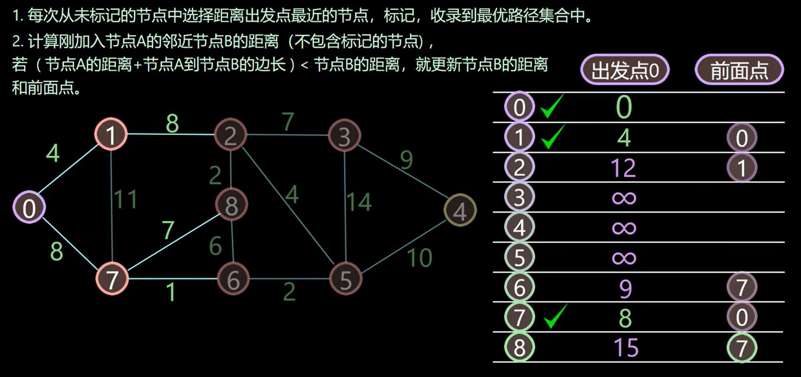
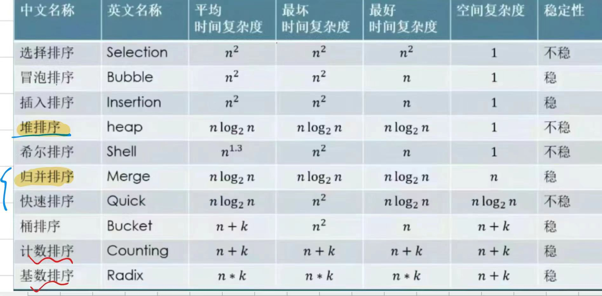

1<<数据结构>>复习题
--------------------1、2、3章---------------------------
- 1.以Niklus Wirth的观点，程序等于什么?
  - 数据结构+算法
- 2.算法的重要特性。
  - 有穷性
  - 确定性
  - 可行性
  - 输入
  - 输出
- 3.好算法的标准。
  - 正确性
  - 可读性9
  - 健壮性
  - 高效性
- 4.线性结构的特点。
  - 每个元素最多只有一个前驱和后续
  - 元素间存在一对一的线性关系
  - 线性表中元素有顺序，不能随意更改
- 5.线性结构与非线性结构的区别。
  - 一对一的关系
  - 一对多的关系
- 6.列出所学过的线性结构与非线性结构。
  - 线性：数组、链表、栈、队列
  - 非线性：树、二叉树、图
- 7.头指针、头结点、首元结点的区别。
  - 头指针：指向链表中第一个结点
  - 头结点：链表中第一个结点，可能不包含数据，用于标记链表的开始
  - 首元结点：链表中第一个存储数据的结点。
- 8.带头结点和不带头结点的线性链表的区别。
  - 带头结点：链表第一个结点是头结点，不存储数据，只用于链表的操作
  - 不带头结点：链表的第一个结点直接存储数据，没有单独的头结点 
- 9.单链表、双链表、循环链表的区别及各自的优缺点。
  - 单链表
    - 优点：内存利用率高，适合顺序访问的应用场景。
    - 缺点：无法反向访问，插入删除都需要遍历链表。
  - 双链表
    - 优点：双向遍历，插入删除更加灵活
    - 缺点：前驱指针需要更多内存存放
  - 循环链表
    - 优点：可以从表头到表尾，适合环形队列应用
    - 缺点：需要注意无限循环的情况。
- 10.栈和队列是什么样的线性表?
  - 栈：LIFO后进先出
  - 队列：FIFO先进先出
- 11.指出顺序线性表、顺序栈、顺序队列的区别。
  - 顺序线性表：支持随机访问
  - 顺序栈：只能在一端（栈顶）进行插入和删除操作
  - 顺序队列：在一端插入，一端删除。
- 12.举出几个栈和队列的实例及用栈和队列所能解决的问题。
  - 栈实例：表达式求值、函数调用堆栈、浏览器历史记录
  - 队列实例：BFS、任务调度、打印队列
  - 栈应用：括号匹配、递归求解、后缀表达式
  - 队列应用：消息队列、进程调度
- 13.指出通常解决"队列"、"栈"的"溢出"时所能用到的方法。
  - 队列：循环队列或动态扩容数组
  - 栈溢出：链栈和两栈堆叠或者是使用动态扩容的数组作为栈
- 14.循环队列的循环是怎样实现的?
  - 取模运算 rear = (rear + 1) % maxSize
 -----------------------5、6、7章-----------------------------------
- 15.给出对称矩阵、三角矩阵的节省内存的存储结构并写出相应的输入、输出算法。
- 16.给出稀疏矩阵的节省内存的存贮结构并写出相应的输入、输出算法。
- 17.用十字链表存储稀疏矩阵时, 矩阵的每个元素同时在几条链上, 分别被称为什么链？
  - 分别在两条链上，行链和列链
- 18.给出树的不同的几种表示形式。
  - 双亲表示法 
  - 孩子表示法 
  - 孩子兄弟表示法
- 19.在二叉树的第i层上至多有多少个结点。 深度为 K的二叉树至多有多少个结点。
  - 第 i 层 2 ^ (i - 1) 个结点
  - 深度为h 2 ^ k - 1 个结点
- 20.在一颗二叉树中, 其叶子结点数n0和度为二的结点数n2之间的关系。
  - n0 = n2 + 1
- 21.有n个结点的完全二叉树的深度。
  - log2n + 1
- 22.在二叉树的顺序存贮结构中如何求结点的双亲、孩子?
  - 左孩子 2i + 1
  - 右孩子 2i + 2
  - 双亲 (i - 1) / 2
- 23.有n个结点的二叉树用二叉链表存贮时有多少个空链域，用三叉链表存贮时有多少个空链域。
  - 二叉n + 1
  - 三叉2n + 1
- 24.为什么可在不增加指针域的情况下，对二叉树进行线索化，线索化的目的是什么?
  - 对n + 1个空连域进行线索化，方便遍历，在进行树遍历的过程快速地查找到结点前驱和后继
- 25.对于已线索化的二叉树如何识别指针域是指向孩子还是指向其后继结点?
  - 看tag的值，为1时分别指向前驱或者后继
- 26.树的几种存贮结构(双亲表示法、孩子表示法、孩子兄弟表示法)的优缺点，各自适应的运算。
  - 双亲
    - 容易找到双亲和祖先结点
    - 较难找到兄弟和孩子结点
    - 适用于频繁访问父亲结点
  - 孩子表示法
    - 容易找到孩子
    - 较难找到双亲
    - 频繁访问孩子结点
  - 孩子兄弟
    - 容易找到兄弟和孩子
    - 需要更多的指针，占用更多的内存空间
    - 频繁访问孩子兄弟结点
- 27.哪种存贮结构可将森林转为二叉树。此种结构各域的注释。说明在这个结构中怎样找到森林的n棵树。
  - 孩子兄弟表示法可以将森林转为二叉树。
- 28.树的先根遍历、后根遍历对应其二叉树的哪种遍历，森林的先根遍历、中根遍历对应其二叉树的
哪种遍历? 
- 29.写算法求树中结点的度；树的度；树中的叶子结点数；树中的非终端结点数；树中某结点的兄弟、
祖先、子孙、层次、堂兄弟；树的高度；森林中树的数目。

- 30.Huffman树能够解决的问题是什么？如何构造Huffman树？
  - 数据压缩和编码问题
```java
// 构建哈夫曼树
    private static HuffmanNode buildHuffmanTree(Map<Character, Integer> frequencyMap) {
        PriorityQueue<HuffmanNode> priorityQueue = new PriorityQueue<>();
        for (Map.Entry<Character, Integer> entry : frequencyMap.entrySet()) {
            priorityQueue.add(new HuffmanNode(entry.getKey(), entry.getValue()));
        }

        while (priorityQueue.size() > 1) {
            HuffmanNode left = priorityQueue.poll();
            HuffmanNode right = priorityQueue.poll();
            HuffmanNode parent = new HuffmanNode('\0', left.frequency + right.frequency);
            parent.left = left;
            parent.right = right;
            priorityQueue.add(parent);
        }

        return priorityQueue.poll(); // 返回哈夫曼树的根节点
    }

    // 生成哈夫曼编码
    private static Map<Character, String> generateHuffmanCodes(HuffmanNode root) {
        Map<Character, String> huffmanCodes = new HashMap<>();
        generateHuffmanCodesRecursive(root, "", huffmanCodes);
        return huffmanCodes;
    }

    // 递归生成哈夫曼编码的函数
    // 参数说明：
    // - node: 当前处理的哈夫曼树节点
    // - code: 当前节点的哈夫曼编码（初始为空字符串）
    // - huffmanCodes: 用于存储字符的哈夫曼编码的映射
    private static void generateHuffmanCodesRecursive(HuffmanNode node, String code, Map<Character, String> huffmanCodes) {
        // 如果当前节点为空（已经到达叶子节点的子节点或者空节点），则结束递归
        if (node == null) {
            return;
        }

        // 如果当前节点包含有效字符（叶子节点），则将字符和对应的哈夫曼编码存储到映射中
        if (node.data != '\0') {
            huffmanCodes.put(node.data, code);
        }

        // 递归处理左子节点，将当前编码加上 '0'，表示左分支
        generateHuffmanCodesRecursive(node.left, code + "0", huffmanCodes);

        // 递归处理右子节点，将当前编码加上 '1'，表示右分支
        generateHuffmanCodesRecursive(node.right, code + "1", huffmanCodes);

    }
```
- 31.何为完全图、稀疏图、稠密图。
  
- 32.写算法求无向图中结点的度；有向图中结点的入度和出度。
- 33.图的数组表示法、邻接表存贮结构各自的优缺点，适应的运算。
  - 数组表示法（邻接矩阵）
    - 优点：存取速度快，适用于稠密图
    - 缺点：占用空间较多
  - 邻接表
    - 优点：节省空间，插入删除效率高
    - 缺点：判读连通较慢，需要遍历链
- 34.最小生成树的实际应用背景。
  - 网络设计
  - 交通规划
  - 集群分析
- 35.什么图适合用Prim算法求最小生成树，什么图适合用 Kruskal算法求最小生成树。
  - Prim算法：适合边稠密图
  - Kruskal算法：适合边稀疏图
- 36.图示用 Prim算法及 Kruskal算法求最小生成树的过程。
- 37.举例简述"拓扑排序"所解决的实际问题。
  - 解决有向无环图DAG中结点排序问题
    - 课程安排
    - 任务调度顺序
    - 编译顺序
- 38.请图示”拓扑排序”的过程。
  - 每次选取入度为0的结点输出，并删除该结点和对应边集
- 39.什么是关键活动？举例简述"关键路径"所解决的实际问题。
  - 关键活动：在项目管理中，关键路径上的活动称为关键活动。它们直接影响项目的完成时间。
  - 关键路径：用于确定项目的最早完成时间，并识别哪些活动是关键的，不能有任何延迟。例如，在建筑项目中，关键路径帮助识别哪些任务必须按时完成以确保整个项目按时完工。
  - AOE网的关键路径
- 40.Dijkstra算法和弗洛伊德(Floyd)算法是如何求最短路径的？两种算法各自的优缺点是什么？
  - Dijkstra
  - Floyd
- -----------------------9、10章-----------------------------------
- 41.顺序查找、折半查找、分块查找算法适合的场合。如果线性表既要快速查找又经常动态变化，要选择什么查找算法？
  - 顺序查找：适合于无序表或表较小的场合。顺序查找不需要对数据进行预处理，直接遍历所有元素。
  - 折半查找：适合于有序表。由于折半查找每次都将查找范围缩小一半，所以在数据量较大且有序的情况下效率较高。
  - 分块查找：适合于大规模有序表。在这种情况下，先分块，再对块进行折半查找或顺序查找，可以提高查找效率。
  - 若想要满足快速查找和动态变化，考虑使用：红黑树、跳表
- 42.如何通过折半查找判定树求等概率时查找成功和不成功的平均查找长度ASL？
- 43.怎样从二叉排序树得到有序表。
  - 中序遍历
- 44.已知长度为n 的表按表中元素顺序构造二叉平衡树，图示构造过程。
- 45.各种查找算法的平均时间复杂度。
  - 
- 46.哈希函数的构造方法有哪些？选取哈希函数应考虑哪些因素？开放定址哈希表的存储结构是什
么样的？如何为一组关键字构造哈希函数并建立哈希表？哈希表适合的场合是什么？决定哈希表查
找的ASL的因素有哪些？如何求哈希表的平均查找长度ASL？
  - 构造方法
    - 取模 h(k) = k mod m
    - 平方取中
    - 随机数法
  - 考虑因素
    - 分布均匀
    - 地址空间尽可能小 
  - 一维数组存储，寻找空位置 
- 47.指出希尔排序，归并排序，快速排序，堆排序，基数排序中稳定的排序方法，并对不稳定的举出
反例。
  - 不稳定：希尔、快排、堆、冒泡
- 48.什么是堆？堆排序算法选用什么样的存贮结构，按此算法得到的有序表是递增还是递减的。图示
建堆过程。
- 49.藉助于"比较"进行排序的算法在最坏情况下能达到的最好的时间复杂度是什么?
- 50.指出直接插入排序，冒泡排序，快速排序, 堆排序，基数排序算法各适合的场合。
- 51.指出各种排序算法的平均时间复杂度、最坏情况的时间复杂度。
- 52.请对学习<<数据结构>>这门课程进行全面总结。 