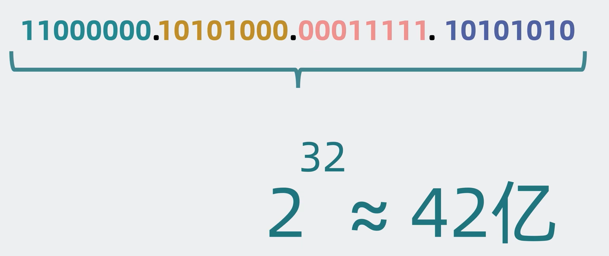
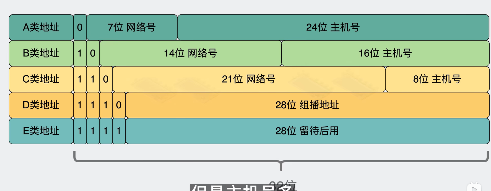
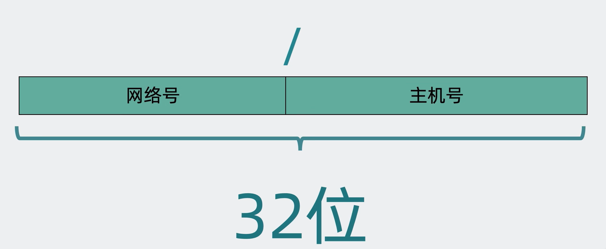

### ip组成
网络号+主机号

ipv4 -> ipv6
### ip分类
(实际使用很少了，设计存在不合理的地方)
网络号和主机号是此消彼长的关系 -> 结合停车场的规模和数量理解

**CIDR 无类比域间路由**
用"/"分割网络号和主机号，如下图，"/"右边的数字表示有多少个网络号，其余为主机号

但是ipv4下的ip玩得再花都是42亿，如何扩展呢？（做乘法）

大网络（广域网 公网ip/共有ip） -> 小网络（局域网 内网ip/私有ip）
具体场景下的应用如，街道的ip

### ipv4小总结
尽管数量是有限，但能够根据路由手段划分内外网，拓展可用ip的数量远大于42亿。

### 常见的ip
- 127.0.0.1：本地回环地址 -> 也就是说 去ping这个地址时，实际上是再请求一个回环地址，没有通过真网卡发送消息，而是通过假网卡（本地回环接口）处理
，只要走本地回环接口，都不会通过网卡发送数据到网关，而是重新走了遍网络层，数据链路层发送回来了。

追问：ping回环地址和ping本地地址有什么区别？
妹有区别

- 0.0.0.0：ipv4下表示无效的目标地址，通常用在监听端口ip请求的操作

- localhost：DNS域名 -> 解析 127.0.0.1

首先让我们了解下ping命令，它是一个应用层的命令，用于判断机器网络是否连通