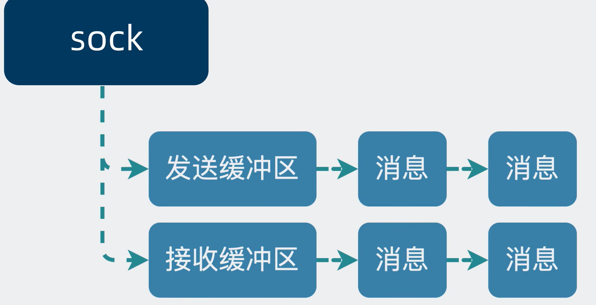
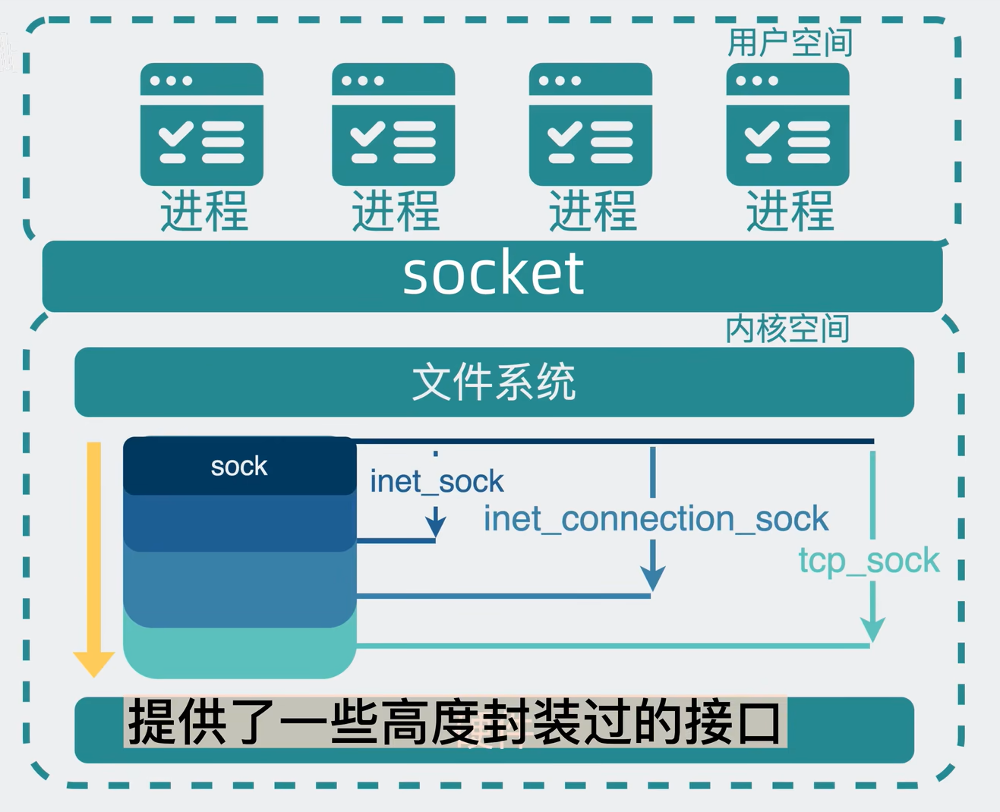
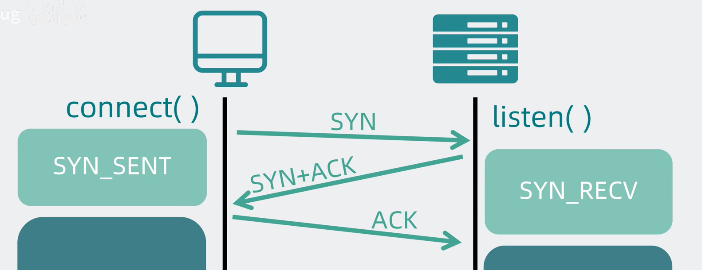

### 剖析Socket
应用场景：无非就是两端之间先建立连接（如何建立连接？思考），再发送消息（读/写）。

且由于各个端口数量肯定是不止一个的，我们需要对端口进行表示 -> ip（定位机器）:端口（定位进程）

在完成了链接，需要解决数据传输间 -> tcp/udp/ICMP协议 其中有相同逻辑的业务功能，可以利用面向对象的思想，把其封装成类sock，通过继承的方式
实现业务。

其实就是在计算机操作系统内核空间里，实现网络的传输功能结构是sock，这个sock基于不同的协议和结构，可被进一步拆分成不同类型。网络传输是一个
偏向底层的操作，sock结合硬件来实现网络传输的功能。为了将这部分的功能暴露给用户空间，引入了socket层，将sock嵌入到文件系统的框架中，通过
暴露fd文件句柄（其实也就是int类型的值，类似于身份证id）的形式，供用户调用。这里有一点像是应用前后端分离的思想。

### 建立连接和数据传输
首先客户端执行connect()方法，传入sock_fd 和 ip端口，内核通过sockfd句柄找到对应的sock结构，sock结构向服务端发起三次握手后就可以开始
传输数据了。服务端发送数据的流程主要就用到send()方法，通过sock_fd句柄找到对应文件将数据放在缓冲区中，等待内核发送。

那么如何标记传输的信息呢？通过ip生成哈希值，存放在哈希表中。

### tcp三次握手 四次挥手