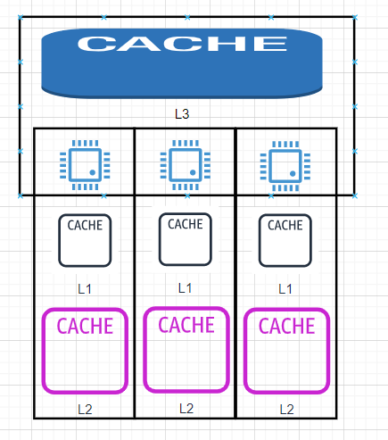

# Redis知识库
### 缓存在系统设计的应用
#### 计算机硬件高速缓存
- L1:CPU
- L2:缓存更大，但是稍慢于L1
- L3:比L2更大、更慢，多个CPU核心共享

#### TLB 虚拟地址和物理地址的映射
#### 客户端http缓存
#### CDN内容分发网络
#### 负载均衡器缓存
#### Kafka消息队列
#### Redis分布式缓存
#### Elastic Search全文搜索引擎
#### mysql数据库缓存
- buffer pool缓冲池
- 事务日志
### Redis的数据结构

### Redis用途
- 缓存加速
- 会话存储
- 分布式锁
  - SETNX
  - SET IF NOT EXIST
- 限流
- 排行榜Sort set
### 为什么Redis性能搞
- 内存数据库
  - 高性能读写
  - 低延迟
- 单线程
  - 减少进程创建、切换导致的性能消耗
  - 多线程需要使用锁或其他同步机制，存在性能消耗
- IO多路复用

  
- 高效的数据结构
  - 哈希表
  - 跳表
  - 