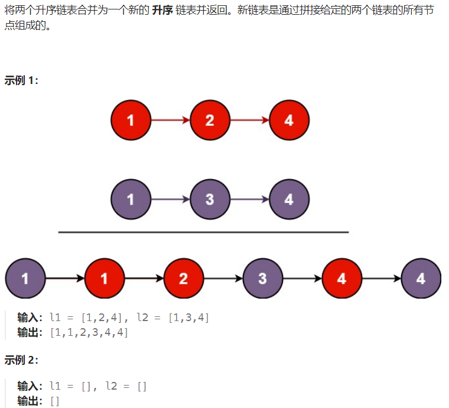

# 合并两个有序链表

### 思路
这道题类似归并排序中最后合并的部分

由于是链表，采用尾插法新增节点

注意最后需要处理不存储数据的头结点

```java
/**
 * Definition for singly-linked list.
 * public class ListNode {
 *     int val;
 *     ListNode next;
 *     ListNode() {}
 *     ListNode(int val) { this.val = val; }
 *     ListNode(int val, ListNode next) { this.val = val; this.next = next; }
 * }
 */
class Solution {
    public ListNode mergeTwoLists(ListNode list1, ListNode list2) {
        ListNode temp = new ListNode();
        temp.next = null;
        ListNode res = temp;    // 存在头结点，最后需要处理
        while(list1 != null && list2 != null){
            if(list1.val < list2.val){
                temp.next = new ListNode(list1.val,null);   // 尾插法
                temp = temp.next;
                list1 = list1.next;
            }else{
                temp.next = new ListNode(list2.val,null);   // 尾插法
                temp = temp.next;
                list2 = list2.next;
            }
        }

        // 处理剩余的元素
        while(list1 != null){
            temp.next = new ListNode(list1.val,null);   // 尾插法
            temp = temp.next;
            list1 = list1.next;
        }

        while(list2 != null){
            temp.next = new ListNode(list2.val,null);   // 尾插法
            temp = temp.next;
            list2 = list2.next;
        }
        res = res.next; // 去除头结点
        return res;
    }
}
```