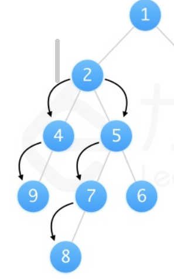

# 二叉树直径
### 题目描述
给你一棵二叉树的根节点，返回该树的 直径 。

二叉树的 直径 是指树中任意两个节点之间最长路径的 长度 。这条路径可能经过也可能不经过根节点 root 。

两节点之间路径的 长度 由它们之间边数表示。
### 思路
最长的路径不一定是经过根节点的，如下图



因此需要在中间代码执行贪心

分析可知，最长路径其实就是在计算左右子节点最大节点数量

因此我们可以把问题转换为去递归计算最大左右子节点个数L和R

路径的数量 = 当前最短路径的节点数量 - 1

```java
/**
 * Definition for a binary tree node.
 * public class TreeNode {
 *     int val;
 *     TreeNode left;
 *     TreeNode right;
 *     TreeNode() {}
 *     TreeNode(int val) { this.val = val; }
 *     TreeNode(int val, TreeNode left, TreeNode right) {
 *         this.val = val;
 *         this.left = left;
 *         this.right = right;
 *     }
 * }
 */
class Solution {
    int res;
    public int diameterOfBinaryTree(TreeNode root) {
        res = 1;
        recursion(root);
        return res;
    }

    public int recursion(TreeNode node){
        if(node == null){
            return 0;
        }
        
        // 分别计算左右子节点最长的个数
        int L = recursion(node.left);  
        int R = recursion(node.right);
        
        // 贪心更新
        res = Math.max(res,L + R);  // 不需要加上当前节点
        // 返回当前节点最长的节点个数
        return Math.max(L,R) + 1;
    }
}
```