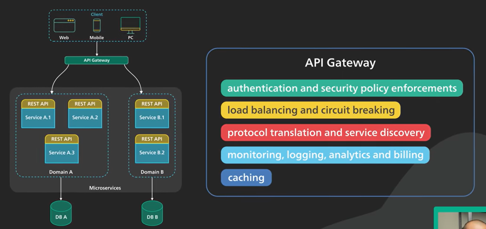

# Gateway
### 基本功能

- 安全校验
- 负载均衡
- 服务熔断 降级
- 协议解析与服务发现
- 检测、日志
- 静态缓存

### 网关流程

网关可实现
- 参数校验
- 鉴权
- ip限流
- 动态路由 + 服务发现
- 协议对流(流量分发)
### Nginx常见应用场景
- 不停服更新
- 负载均衡
- 反向代理
- 高并发机器水平扩容
- 域名重定向

### 代理
- 正向代理：正向代理是一种代理服务器，位于客户端和服务器之间，用于客户端向目标服务器发送请求。客户端通过正向代理访问目标服务器。
  - 隐藏客户端的信息(翻墙)，使用户信息更加难以追踪
  - 绕过浏览限制，如政府、学校、大企业内部系统使用防火墙限制外部互联网访问
  - 实现内容的访问限制，部分代理需要客户端配置后才能进行访问，如企业内网应用
- 反向代理：反向代理位于服务器端，用于服务器向客户端提供服务。客户端通过反向代理访问目标服务器，客户端并不知道目标服务器的存在。
  - 服务端ip保护，防止暴露服务端ip，避免DDOS
  - 负载均衡
  - 缓存请求资源
  - 减少SSL解析次数，提高性能

